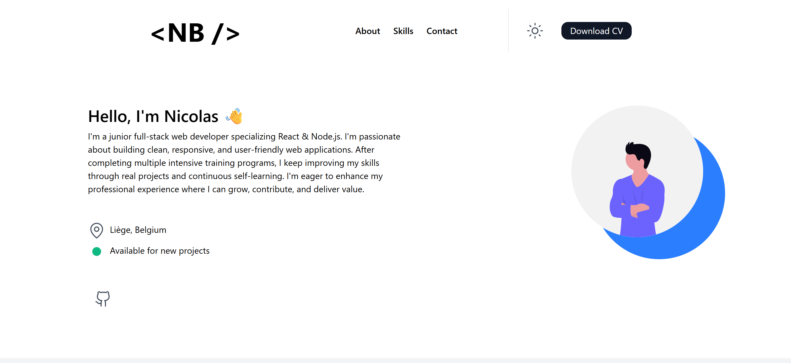

# Portfolio

This is my personal portfolio website, built to showcase my skills, projects, and contact information as a Junior Web Developer.

## 🚀 Tech Stack
- React
- TailwindCSS
- Vite
- Git & GitHub
- Deployed on Vercel

## 📌 Features
- Responsive Design (desktop & mobile)
- Skills Section (React, Node.js, MongoDB, etc.)
- About Me (training: Becode, FullStackOpen, The Odin Project)
- Downloadable CV (PDF)
- Copy to Clipboard Contact
- Link to GitHub

## 🌐 Live Demo
👉 [View Portfolio]()

## 📷 Preview
  
*(Add a screenshot of your homepage once deployed)*

## 📄 License
This project is for personal use. Feel free to get inspired, but please don’t copy-paste without adapting.
